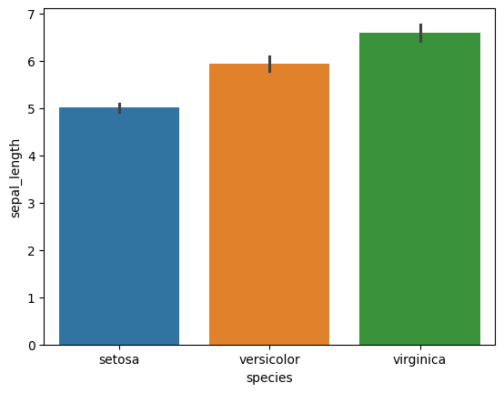
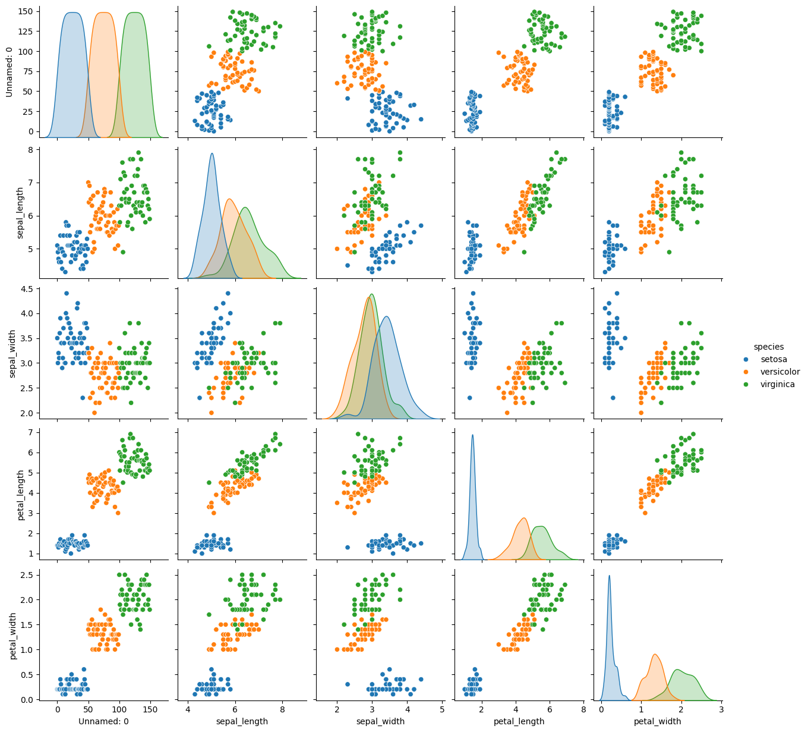
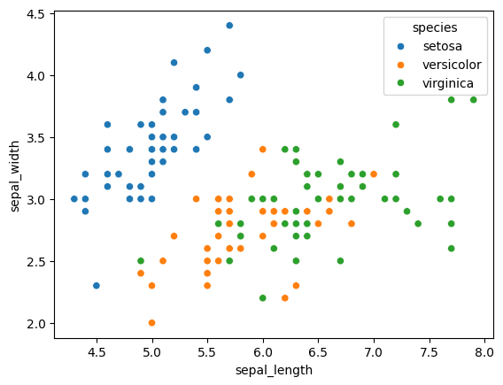
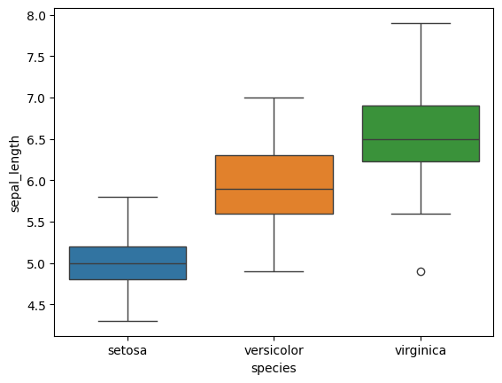
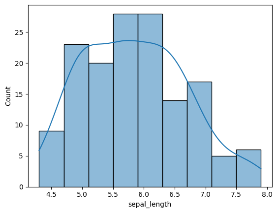
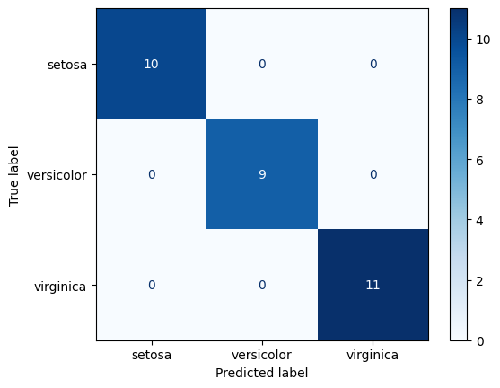
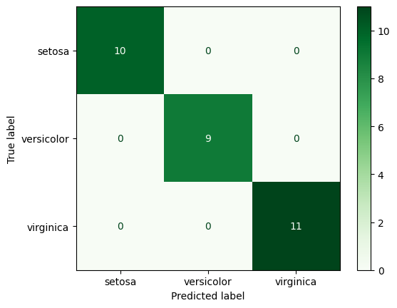
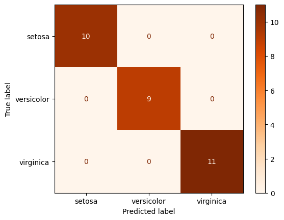
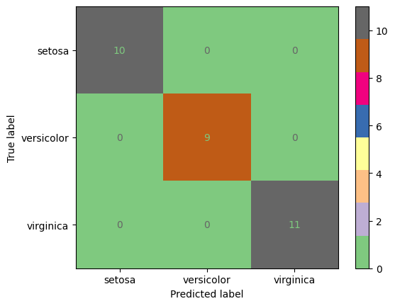

# Classification perform on Iris Data set 

---


# ========*INDEX*========
[Explore Iris Data Set](#explore-dataset)

[Visualize data set](#visualize-data-set)

[Model Impliment](#model-impliment)

# Explore Dataset
>1- Import Librariies

```python
import pandas as pd
import numpy as np
import seaborn as sns
import matplotlib.pyplot as plt
```

>2-Data set import from seaborn

```python
df=sns.load_dataset('iris')
#save in csv_format
df.to_csv("Iris_data_set.csv")
# import csv fiile
df=pd.read_csv("Iris_data_set.csv")
```

>3- Explore data set through different functiions

```python
df.head()
df.columns
df.dtypes
df.info()
df.describe()
df.isnull().sum()
df.index
```

# Visualize data set

>1-Barplot 

Bar Plot: Used to compare values across different categories.

```python
sns.barplot(x='species',y='sepal_length',data=df,hue='species')
```


>2-PairPlot

Pair Plot: Used to visualize relationships between all numerical features in a dataset at once.

```python
sns.pairplot(df,hue='species')
```


>3-scatterplot

Scatter Plot: Used to observe the relationship or correlation between two numerical variables.

```python
sns.scatterplot(x='sepal_length',y='sepal_width',hue='species',data=df)
```


>4-Boxplot

Box Plot: Used to show data distribution, median, quartiles, and detect outliers.

```python
sns.boxplot(x='species',y='sepal_length',data=df,hue="species")
```


>5-Histplot

Histogram: Used to visualize the frequency distribution of a single numerical variable.

```python
sns.histplot(df['sepal_length'],kde=True)
```


# Model Impliment

>1-Logistic Regression
```python

from sklearn.linear_model import LogisticRegression
from sklearn.metrics import classification_report,accuracy_score
from sklearn.model_selection import train_test_split
from sklearn.preprocessing import StandardScaler
from sklearn.pipeline import Pipeline

x=df.drop(['species'],axis=1)
y=df['species']

x_train,x_test,y_train,y_test=train_test_split(x,y,test_size=0.2,random_state=42)

pipe = Pipeline([
    ('scaler', StandardScaler()),
    ('lr', LogisticRegression(max_iter=1000))
])
pipe.fit(x_train,y_train)
y_pred=pipe.predict(x_test)

classification=classification_report(y_test,y_pred)
Accuracy=accuracy_score(y_test,y_pred)
print(classification)
print(Accuracy)

from sklearn.metrics import confusion_matrix, ConfusionMatrixDisplay
import matplotlib.pyplot as plt

cm = confusion_matrix(y_test, y_pred)

disp = ConfusionMatrixDisplay(
    confusion_matrix=cm,
    display_labels=['setosa', 'versicolor', 'virginica']
)

disp.plot(cmap='Blues')
plt.show()

```


>2-SVM(Support Vector Machine)

```python
from sklearn.svm import SVC
svm= SVC(kernel='rbf',C=1.0,gamma='scale')
svm.fit(x_train,y_train)
y_pred_svm=svm.predict(x_test)

from sklearn.metrics import classification_report

print(classification_report(y_test, y_pred_svm,
      target_names=['setosa', 'versicolor', 'virginica']))

from sklearn.metrics import accuracy_score
accuracy_score(y_test,y_pred_svm)

from sklearn.metrics import confusion_matrix, ConfusionMatrixDisplay
import matplotlib.pyplot as plt

cm_svm = confusion_matrix(y_test, y_pred_svm)

disp = ConfusionMatrixDisplay(
    confusion_matrix=cm_svm,
    display_labels=['setosa', 'versicolor', 'virginica']
)

disp.plot(cmap='Greens')
plt.show()
```


>* with GridSearch cv

GridSearchCV finds the best hyperparameters(seperate classes) automatically using cross-validation.

```python
from sklearn.svm import SVC
from sklearn.model_selection import GridSearchCV
from sklearn.preprocessing import StandardScaler
from sklearn.pipeline import Pipeline

# Pipeline (Scaling + SVM)
pipe = Pipeline([
    ('scaler', StandardScaler()),
    ('svm', SVC())
])

# Parameter Grid
param_grid = {
    'svm__kernel': ['linear', 'rbf'],
    'svm__C': [0.1, 1, 10, 100],
    'svm__gamma': ['scale', 'auto']
}

# GridSearchCV
grid = GridSearchCV(
    pipe,
    param_grid,
    cv=5,
    scoring='accuracy'
)

# Train
grid.fit(x_train, y_train)

print("Best Parameters:", grid.best_params_)
print("Best CV Accuracy:", grid.best_score_)
```


>3-Random Forest
```python
from sklearn.ensemble import RandomForestClassifier

model= RandomForestClassifier(
    n_estimators=100,
    random_state=42
)

model.fit(x_train, y_train)

y_pred_random = model.predict(x_test)

from sklearn.metrics import classification_report

print(classification_report(
    y_test,
    y_pred_random,
    target_names=['setosa', 'versicolor', 'virginica']
))

from sklearn.metrics import confusion_matrix, ConfusionMatrixDisplay
import matplotlib.pyplot as plt

cm_random = confusion_matrix(y_test, y_pred_random)

disp = ConfusionMatrixDisplay(
    confusion_matrix=cm_random,
    display_labels=['setosa', 'versicolor', 'virginica']
)

disp.plot(cmap='Oranges')
plt.show()
```


>4-KNN (K_Nearest_NEiighbour)

```python
from sklearn.neighbors import KNeighborsClassifier


knn = KNeighborsClassifier(n_neighbors=5)
knn.fit(x_train, y_train)

y_pred_knn = knn.predict(x_test)

from sklearn.metrics import classification_report

print(classification_report(
    y_test,
    y_pred_knn,
    target_names=['setosa', 'versicolor', 'virginica']
))

from sklearn.metrics import confusion_matrix, ConfusionMatrixDisplay
import matplotlib.pyplot as plt

cm_knn = confusion_matrix(y_test, y_pred_knn)

disp = ConfusionMatrixDisplay(
    confusion_matrix=cm_knn,
    display_labels=['setosa', 'versicolor', 'virginica']
)

disp.plot(cmap='Accent')
plt.show()
```
